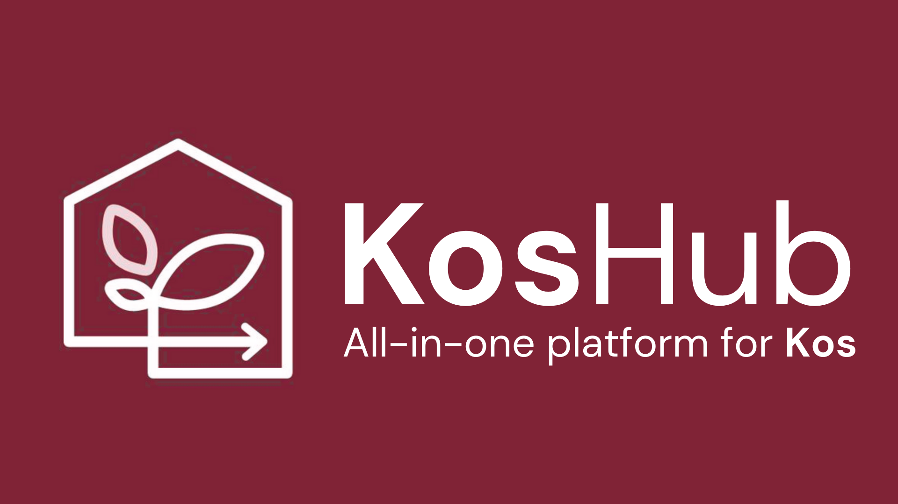

# KosHub - Platform Terintegrasi untuk Akomodasi & Layanan Pendukung Kehidupan

**Tugas 3 - Integrasi Layanan (II3160 UAS)**

  

KosHub adalah platform web komprehensif yang mengintegrasikan dua microservices: **Pemesanan Akomodasi** dan **Layanan Pendukung Kehidupan**. Dibangun dengan teknologi web modern dan prinsip Domain-Driven Design (DDD), KosHub menyediakan pengalaman yang mulus bagi mahasiswa dan penghuni kos untuk menemukan akomodasi dan mengelola layanan kehidupan sehari-hari.

## Fitur

### Konteks Pemesanan Akomodasi
- Telusuri akomodasi kos yang tersedia
- Autentikasi dan registrasi pengguna
- Sistem diskon berbasis keanggotaan (BASIC, SILVER 5%, GOLD 10%)
- Pemesanan berbasis tanggal dengan pelacakan ketersediaan
- Kalkulasi diskon otomatis

### Konteks Layanan Pendukung Kehidupan
- **Layanan Laundry**
  - Berbagai jenis layanan (Cuci, Cuci+Setrika, Dry Clean, Setrika Saja)
  - Harga berbasis berat
  - Penjadwalan penjemputan dan pengiriman
  - Pelacakan pesanan real-time

- **Layanan Catering**
  - Kategori makanan (Sarapan, Makan Siang, Makan Malam, Snack)
  - Pemilihan menu yang dapat disesuaikan
  - Dukungan permintaan khusus
  - Penjadwalan pengiriman

### Fitur Tambahan
- Sistem notifikasi real-time
- Dashboard pengguna untuk mengelola pemesanan dan layanan
- Desain yang sepenuhnya responsif
- UI modern dengan palet warna pink/merah kustom
- Cepat dan dioptimalkan dengan Next.js 16

## Stack Teknologi

### Frontend
- **Framework**: Next.js 16 (App Router)
- **Bahasa**: TypeScript
- **Styling**: Tailwind CSS 4
- **HTTP Client**: Axios
- **Icons**: Lucide React
- **Penanganan Tanggal**: date-fns

### Backend Services
- **Accommodation Service**: Express.js + PostgreSQL (Supabase)
  - URL: `http://18223088.tesatepadang.space`
  - Autentikasi dengan Supabase Auth

- **Living Support Service**: Express.js + PostgreSQL (Supabase)
  - URL: `http://18223054.tesatepadang.space`
  - Autentikasi dengan Supabase Auth

Aplikasi akan tersedia di `https://ii3160-koshub-uas.vercel.app/`

## Tim

- **Wijaksara Aptaluhung - 18223088** - Developer Accommodation Microservice dan Front-End pada Repository ini
- **Allodya Qonnita Arofa (Partner) - 18223054** - Developer Living Support Microservice
